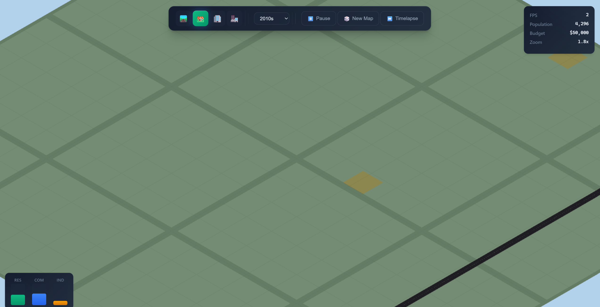

<p align="center">
  
</p>

<h1 align="center">WebCity</h1>
<p align="center"><em>A SimCity‑style sandbox entirely in the browser</em></p>

<p align="center">
  
  
  
</p>

---

> [!NOTE]
> This project is an early prototype; procedural generation and AI texturing workers are still in progress.

## Table of Contents
- [Features](#features)
- [Quick Start](#quick-start)
- [Architecture](#architecture)
- [Road Generation Highlights](#road-generation-highlights)
- [Project Status](#project-status)

## Features
- 🧠 Multi-worker architecture keeps the UI responsive.
- 🗺️ Procedural roads, parcels and buildings with era-aware rules.
- 🎨 AI‑assisted PBR texture stylization.
- ⚙️ WebGPU renderer with WebGL2 fallback.
- 🧱 Deterministic seeds for reproducible cities.

## Quick Start
```bash
cd simcity-web-starter
npm install
npm run dev
```
Vite serves with the required COOP/COEP headers so `SharedArrayBuffer` and WebGPU work locally.

## Architecture
| Worker | Role | Highlights |
| ------ | ---- | ---------- |
| Main Thread | UI orchestration, DOM, input handling | Communicates with workers via `postMessage` |
| Render Worker | WebGPU/WebGL2 rendering | Uses `OffscreenCanvas` for high FPS |
| Sim Worker | Game simulation (60 ticks/sec) | Zone development, civic buildings, demand calculations |
| ProcGen Worker | Procedural generation | Road graphs, parcels, buildings |
| AI Worker | Texture generation | PBR material stylization with ONNX Runtime |


## Road Generation Highlights
<details>
<summary>Algorithm phases</summary>

1. Generate city centers with Poisson disk sampling  
2. Create highway network between centers  
3. Add radial/organic roads from centers  
4. Fill with adaptive grid patterns  
5. Add local roads to fill gaps  
6. Connect isolated sections  
7. Optimize intersection angles  
8. Apply era-based materials  

</details>

## Project Status
- ✅ Basic worker architecture with message passing
- ✅ WebGPU/WebGL2 renderer initialization
- ✅ Fixed-step simulation loop (60 ticks/sec)
- ⚠️ Procedural road graph generation (stubbed)
- ⚠️ AI texture generation (stubbed)

---

Made with 💙 for the web.
